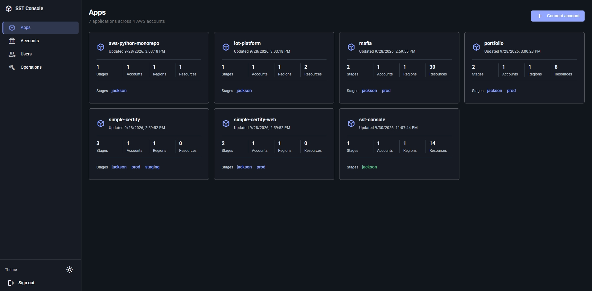
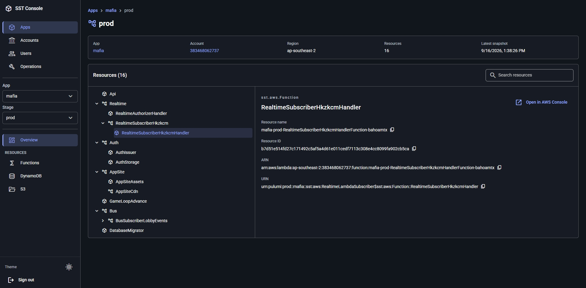
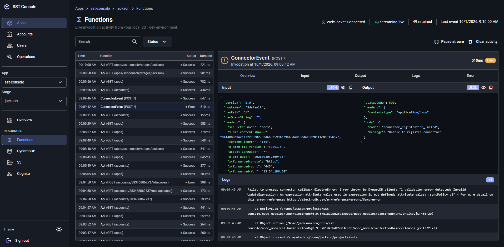

# SST Console

> **Very early work in progress. Not fit for personal, community, or production use.**

SST Console is an experimental, self-hosted control plane for viewing SST v4 resources across AWS accounts in one organization. One installation is intended to run in a dedicated AWS control account and connect workload accounts through explicit cross-account roles.

Development is moving quickly. Features, APIs, infrastructure, data models, and security boundaries may change without notice. Do not deploy this against AWS accounts or data you cannot afford to lose or expose.

## Status

SST Console has early functionality for browsing apps, stages, and resource metadata from connected AWS accounts. It also augments a local `sst dev` session: when the Console is open on the matching app and stage, its Functions workspace shows live cross-function invocation activity, including input, output, logs, errors, and duration.

This is not yet a complete Console. Function inspection for deployed stages, resource actions, and many operational workflows are incomplete.

## Screenshots

### Apps



### Stage resources



### Local `sst dev` Function activity



## Self-hosting

Deploy one Console installation in a dedicated AWS control account. It can then connect workload accounts in your AWS organization.

### Prerequisites

- [Bun](https://bun.sh/)
- AWS credentials for control account, configured as an AWS CLI profile
- AWS permissions to create SST, Cognito, Lambda, DynamoDB, EventBridge, S3, and IAM resources

### Deploy

1. Open [GitHub Releases](https://github.com/JacksonBowe/sst-console/releases) and choose a stable release tag. Do not deploy the moving `main` branch.

2. Clone that release and install dependencies:

    ```bash
    git clone --branch vX.Y.Z --depth 1 https://github.com/JacksonBowe/sst-console.git
    cd sst-console
    bun install --frozen-lockfile
    ```

3. Create local configuration and set AWS profile and deployment region:

    ```bash
    cp console.config.example.ts console.config.ts
    ```

    Edit `console.config.ts`. Set `profile` to AWS CLI profile for control account and `region` to desired AWS region. Configure Cognito password policy if required. To serve Console on custom domain, follow [custom-domain deployment](docs/deploy-to-custom-domain.md).

4. Deploy Console:

    ```bash
    bun run deploy
    ```

5. Open `consoleUrl` from SST deployment output. Create initial user in deployed Cognito User Pool; see [authentication setup](docs/authentication.md).

6. Connect each workload account through **Connect account** in Console. This opens AWS CloudFormation using deployment-specific connector template. Connected accounts publish SST state changes to control account, letting Console index their apps and stages.

> **Warning**
> Current connector creates `SSTConsoleRole` with `AdministratorAccess` in every connected workload account. Review template and its permissions before deployment. Project is early work; use isolated, non-production AWS accounts only.

### Update

1. Open [GitHub Releases](https://github.com/JacksonBowe/sst-console/releases) and select release marked **Latest**. Do not select a **Pre-release**.

2. Read its release notes, then copy its tag name. For example, `v0.1.1`.

3. From existing Console checkout, fetch that release, check it out, and deploy it:

    ```bash
    git fetch --tags
    git checkout v0.1.1
    bun install --frozen-lockfile
    bun run deploy
    ```

Deploy only release tags. Do not run `git pull`, deploy `main`, or use an older release tag as a rollback procedure.

## How this differs from SST's official Console

This is an independent project exploring a different approach:

- **Self-hosted and single-tenant:** each installation is designed to run in its owner's AWS control account for one AWS organization.
- **Cross-account visibility first:** early work focuses on connecting workload accounts and indexing SST state metadata rather than reproducing every Console capability.
- **AWS-owned control plane:** the UI, API, authentication, operational index, and future integrations are intended to run within infrastructure owned by the installation operator.
- **Independent architecture:** the project is being designed around its self-hosted use case rather than compatibility with the official SST Console's APIs, workflows, or deployment model.

## Why a separate implementation?

The goal of this project is to explore a fully self-hosted Console that can run within an organization's own AWS infrastructure.

Building a separate implementation provides the freedom to design around that model from the beginning. In particular, the official Console's architecture includes external services such as PlanetScale, while this project aims to keep its control plane within the operator's AWS environment.

Starting independently also allows the project to evolve without requiring compatibility with the official Console's internal APIs, data model, or deployment architecture.

## Affiliation

SST Console is an independent community project. It is not affiliated with, endorsed by, sponsored by, or officially connected to Anomaly Innovations, Inc., the SST project, or any official SST product.

“SST” is used to describe the project's intended compatibility with SST v4.

## License

Licensed under [Apache-2.0](LICENSE).
